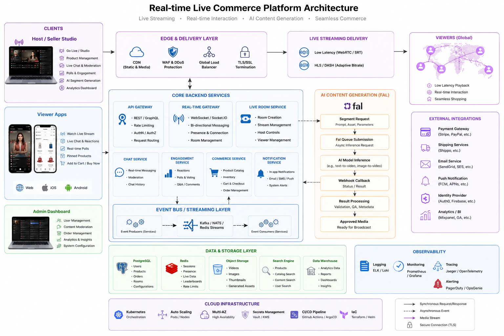

# Live House

**Live House** is an AI-native realtime live-commerce project. This workspace consolidates the runnable application, target architecture, API and event contracts, security decisions, interactive architecture demonstrations, delivery roadmap, sprint backlog, release artifacts, and a development handoff for continued implementation.



## Current release

**Version:** `0.1.0` — runnable, production-shaped local vertical slice

```text
host control
  → transactional session state
  → sequenced domain event
  → WebSocket fanout and replay
  → synchronized viewer UI
  → cart and idempotent checkout
```

```text
scene prompt
  → moderation seam
  → fal queue adapter or local mock
  → verified, idempotent completion webhook
  → deadline and QA gates
  → READY segment
  → explicit ON_AIR action
```

fal is the **AI inference and generation plane**. It is intentionally not the mass-viewer broadcast CDN and not the commerce system of record.

## Workspace layout

```text
live-house/
├── apps/live-commerce/       # Runnable FastAPI app, browser UIs, tests, Docker
├── docs/                     # Architecture, requirements, decisions, sprint plan
│   ├── architecture/        # Application-level contracts and status
│   ├── assets/              # Infographic and preview images
│   ├── decisions/           # Architectural decision records
│   └── demos/               # Interactive architecture sources
├── releases/                 # Installable and historical artifacts
├── scripts/                  # Bootstrap, run, test, verify, package
├── PROJECT.md                # Concise project brief
├── PROJECT_CONTEXT.md        # Full continuation context
├── PROJECT_STATUS.yaml       # Machine-readable current status
├── project.yaml              # Machine-readable project contract
└── AGENTS.md                 # Engineering rules for future development
```

## Start locally

Python 3.11 or 3.12 is recommended.

```bash
make bootstrap
cp apps/live-commerce/.env.example apps/live-commerce/.env
make run
```

Open:

| Surface | URL |
|---|---|
| Project home | `http://localhost:8000/` |
| Host studio | `http://localhost:8000/studio` |
| Viewer app | `http://localhost:8000/viewer` |
| Interactive architecture | `http://localhost:8000/architecture` |
| OpenAPI | `http://localhost:8000/docs` |
| Health | `http://localhost:8000/health` |

Mock generation is the default, so the complete flow works without fal credentials.

## Verify

```bash
make verify
```

This compiles Python, checks browser JavaScript when Node.js is available, verifies required project artifacts, and runs the automated test suite.

## Interactive architecture

- [Standalone interactive architecture](docs/interactive-architecture.html)
- [Architecture source copy](docs/demos/interactive-live-commerce-architecture.html)
- [Desktop preview](docs/assets/interactive-architecture-desktop.png)
- [Mobile preview](docs/assets/interactive-architecture-mobile.png)

The explorer supports current-versus-production modes, component inspection, search, architecture-plane filters, pan/zoom, and animated playback, realtime, AI-generation, and commerce flows.

## What is implemented

- Live-session lifecycle with guarded transitions.
- SQLite transactions and monotonically increasing per-room event sequences.
- Snapshot plus event replay after WebSocket reconnect.
- Chat, heartbeat, reactions, deterministic polls, and room fanout.
- Product catalog, timeline-aware pinning, cart, atomic inventory deduction, and idempotent checkout.
- Generated-segment deadline, stale-result, fallback, QA, ready, and producer-controlled on-air states.
- fal queued-submission boundary and typed H3 Max text-to-video adapter.
- ED25519 fal webhook verification against cached JWKS.
- Idempotent webhook receipt handling.
- Host studio, viewer app, architecture explorer, OpenAPI, Docker, Compose, CI, wheel packaging, and tests.

## Read before continuing development

1. [Project brief](PROJECT.md)
2. [Project context](PROJECT_CONTEXT.md)
3. [Engineering instructions](AGENTS.md)
4. [Master architecture](docs/MASTER_ARCHITECTURE.md)
5. [Requirements](docs/REQUIREMENTS.md)
6. [Architecture decisions](docs/decisions/README.md)
7. [Immediate sprint 0.2](docs/NEXT_SPRINT_0.2.md)
8. [Development handoff](docs/DEVELOPMENT_HANDOFF.md)
9. [Application architecture and contracts](docs/architecture/ARCHITECTURE.md)
10. [Documentation index](docs/INDEX.md)

## Immediate next increment

**0.2 — real fal staging integration**

- Exercise H3 Max through a staging fal project.
- Add a typed reference/image-to-video adapter.
- Add private reference-asset storage and retention.
- Add status reconciliation, cancellation, latency, and cost metadata.
- Validate signed callbacks through a public HTTPS endpoint.
- Copy approved provider output into project-controlled storage.

Definition of done: one real segment reaches `READY` through the normal verified callback path, while malformed, duplicate, unsafe, stale, and late results remain harmless.

## Build and package

Build the application wheel:

```bash
make wheel
```

Create complete project archives and checksums:

```bash
make package
```

The implementation distribution remains named `fal-live-commerce-starter` for compatibility, while both commands are installed:

```bash
live-house
live-commerce
```

## Production boundary

The v0.1 viewer switches media sources to demonstrate the `segment.on_air` contract. The production media increment replaces that with:

```text
host WebRTC/SRT ingest
  + approved generated segment
  + deterministic catalog graphics
  → active/standby compositor
  → encoder and live origin
  → low-latency CDN
  → continuous viewer playback
```

AI, media, realtime interaction, and commerce must remain independently degradable. A fal outage must not stop playback or checkout.

## Primary references

- <https://fal.live/>
- <https://fal.ai/docs/documentation>
- <https://fal.ai/docs/documentation/development/realtime>
- <https://fal.ai/docs/documentation/development/wma>
- <https://fal.ai/docs/documentation/model-apis/inference/webhooks>
