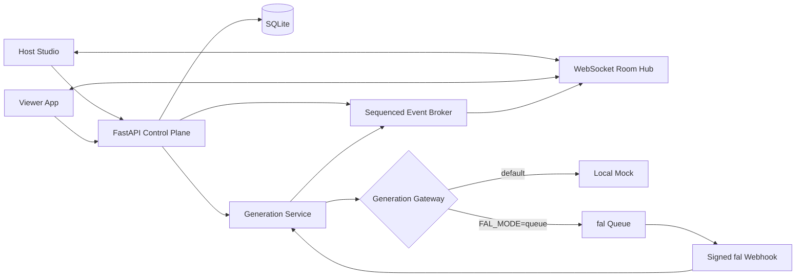
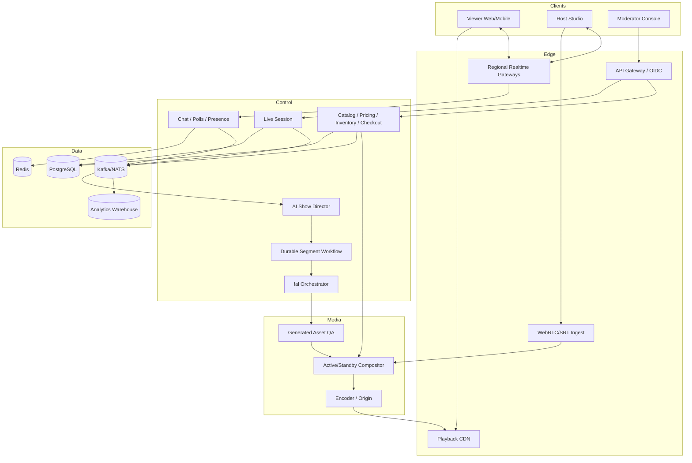

# Architecture

## Current vertical slice

The slice is deliberately a modular monolith. It proves contracts and failure behavior with low operational overhead. Service boundaries are represented by Python classes and event contracts so they can later be extracted.

## Key invariants

1. The catalog is authoritative for names, prices, inventory, and approved facts.
2. Checkout revalidates and atomically commits inventory.
3. Events are ordered by a per-session sequence, not client arrival time.
4. Product and segment events may carry `program_time_ms` for media synchronization.
5. A generated result is not broadcast merely because a provider completed it.
6. Every generated segment has a deadline and a fallback path.
7. fal credentials remain server-side.
8. Webhook signatures are checked before JSON is trusted in queue mode.
9. Repeated webhook deliveries are safe.
10. AI failure must not disable playback or checkout.

## Production target

## Scaling cut lines

### Realtime

`RoomHub` is replaced by regional WebSocket gateways. Domain events enter a durable backbone; ephemeral reactions may use a cheaper Redis/NATS channel and periodic aggregation. Snapshot recovery remains an API concern.

### Transactions

`Store` moves to PostgreSQL. Event publication uses a transactional outbox. Cart, reservation, payment, and order workflows become explicit services as business scope grows.

### Generation

`GenerationService` moves into a durable workflow. Provider completion, QA, human approval, transcoding, cancellation, and stale-result handling become workflow activities. `GenerationGateway` remains the provider boundary.

### Media

`segment.on_air` becomes a command to the compositor scheduler. The viewer receives a continuous CDN stream; it does not switch to the generated asset directly. Viewer-side events remain tied to the program timeline.

## Security progression

- Replace demo identities with OIDC/JWT.
- Issue role- and session-scoped permissions.
- Put all producer actions behind merchant authorization.
- Use a distinct API-scoped fal key per environment.
- Restrict model IDs and generation budgets by merchant policy.
- Add replay protection, audit retention, rate limits, WAF, and bot controls.
- Treat product reference assets and unreleased products as private data.
