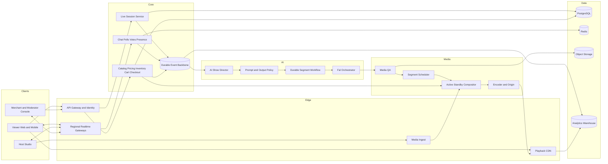

# Live House — Master Architecture

## 1. Purpose

Live House is a realtime live-commerce platform in which a human or virtual host presents products, viewers watch a continuous low-latency program, audience interactions affect the show, and AI-generated media can be inserted safely without making generation a dependency of playback or checkout.

The target experience combines four independently scalable systems:

1. Live media capture, composition, origin, and CDN delivery.
2. Realtime room interaction such as chat, polls, reactions, and presence.
3. Deterministic commerce such as product facts, pricing, inventory, cart, checkout, and orders.
4. AI content generation and show-direction workflows powered through fal.

## 2. Foundational architectural decision

fal is the AI-generation and controlled realtime-inference plane. It is not the one-to-many video distribution plane and it is not a commerce authority.

```text
fal queue / realtime / custom GPU apps
    → generate or transform approved media
    → moderation and QA
    → segment scheduler
    → cloud compositor
    → encoder and live origin
    → CDN
    → viewers
```

This separation prevents GPU/model failures from interrupting the stream or purchase path and allows each plane to scale according to its own unit of load.

- AI generation scales mainly with active channels and requested segments.
- Media egress scales with concurrent viewers and bitrate.
- Realtime interaction scales with room connections and event rates.
- Commerce scales with product interest, reservation, and checkout traffic.

## 3. Product delivery modes

### Mode A — Human host plus AI assistance

A human presenter owns the live program. AI creates B-roll, backgrounds, product demonstrations, captions, translations, and short optional inserts. This is the recommended first commercial mode.

### Mode B — Virtual host plus managed rundown

An avatar or generated presenter delivers approved scripts from a controlled program rundown. Segments are generated ahead of their intended air time and held in a rolling buffer.

### Mode C — Audience-directed generative channel

Viewers submit moderated suggestions or vote on deterministic choices. A show director converts the winning direction into a structured scene plan, and only approved media reaches the scheduler.

## 4. System context



## 5. Architectural planes

### 5.1 Experience plane

Viewer applications provide video playback, chat, reactions, polls, product cards, cart, checkout, captions, reconnect recovery, and accessibility.

The host studio provides camera/microphone preview, ingest health, scene control, product selection, poll management, script/teleprompter, generation requests, preview, explicit approval, and emergency cut controls.

The moderation console provides chat review, prompt approval, generated-output preview, claim verification, scene queue control, user sanctions, and audit access.

### 5.2 Realtime interaction plane

Regional WebSocket gateways serve presence, chat, poll updates, reactions, product events, scene countdowns, inventory updates, and stream-health notifications.

Durable business events use the event backbone. Extremely high-volume ephemeral reactions should use a cheaper fanout path and persist aggregates rather than one record per reaction.

### 5.3 Commerce plane

The commerce plane is authoritative for:

- Product identity and approved facts.
- Current prices and offers.
- Inventory and reservations.
- Cart and checkout.
- Payment, orders, cancellations, and refunds.
- Purchase limits, fraud, tax, and shipping.

AI systems may read approved product facts but cannot mutate commerce state directly.

### 5.4 AI control plane

The AI control plane includes audience-intent aggregation, a structured show director, prompt compilation, model routing, fal job orchestration, moderation, continuity state, deadlines, cost control, and output lineage.

The show director emits a typed `ScenePlan`; it never directly changes price, stock, payment, or order state.

### 5.5 Media production plane

This plane combines host ingest, generated segments, avatars, deterministic product overlays, captions, countdowns, music, transitions, and audio normalization into one continuous encoded program.

Generated text for prices or legally meaningful product claims is not burned into AI video. These are rendered programmatically from the commerce database.

### 5.6 Data and operations plane

This plane contains PostgreSQL, Redis, the event backbone, object storage, analytics, search, secrets, audit logs, traces, metrics, alerting, release controls, and cost attribution.

## 6. Media topology

### Human-host path

```text
camera and microphone
  → WebRTC / SRT / RTMP ingest
  → compositor
  → ABR encoder and origin
  → low-latency CDN
  → viewers
```

### AI-enhanced host path

```text
host source
  → optional fal realtime transformation
  → compositor
  → origin and CDN
```

### Generated-segment path

```text
structured scene plan
  → fal queue or realtime endpoint
  → output validation and moderation
  → approved asset storage
  → rolling segment queue
  → compositor insertion
  → origin and CDN
```

### Fully virtual channel

```text
show state
  → approved script
  → TTS/avatar/video generation
  → buffered segment queue
  → compositor
  → continuous broadcast
```

Broad audience distribution should use a media CDN. WebRTC delivery is reserved for hosts, guests, highly interactive auctions, or smaller rooms that genuinely require subsecond media latency.

## 7. End-to-end show flow

### 7.1 Warm the session

Before a scheduled event:

1. Start origin and standby ingest.
2. Warm compositors and AI runners.
3. Load product references, presenter references, and model weights.
4. Prepare safe fallback clips and holding scenes.
5. Generate initial program segments.
6. Verify synthetic playback and checkout.

### 7.2 Collect audience intent

Every accepted interaction obtains a server event ID, session ID, user ID, server sequence, timestamp, moderation state, trust score, locale, and optional media timeline position.

### 7.3 Moderate before planning

Apply account-abuse, spam, policy, prompt-injection, brand, product-claim, and category rules before audience text reaches the show director.

### 7.4 Select direction deterministically

Vote counting and winner selection are deterministic. An LLM may interpret the winning option but must not decide which option won.

### 7.5 Produce a structured scene plan

A scene plan should contain:

```json
{
  "scene_id": "scene_123",
  "session_id": "live_123",
  "sequence": 41,
  "mode": "broll",
  "duration_ms": 5000,
  "intended_media_start_ms": 483000,
  "script": "Approved presenter script",
  "visual_prompt": "Compiled prompt",
  "product_skus": ["SKU-42"],
  "approved_product_fact_ids": ["fact-17"],
  "character_reference_ids": ["host-ref-2"],
  "previous_frame_asset_id": "asset-991",
  "generation_deadline": "2026-09-01T03:00:00Z",
  "stale_after": "2026-09-01T03:00:05Z",
  "fallback_asset_id": "fallback-product-loop",
  "model_policy": {
    "preferred_models": ["approved-model-a"],
    "fallback_models": ["approved-model-b"],
    "maximum_cost": 1.25,
    "minimum_quality_score": 0.88
  },
  "policy_version": "policy-7",
  "prompt_version": "prompt-12"
}
```

### 7.6 Route generation

The fal orchestrator selects an allowlisted model according to latency, required duration, references, audio, quality, availability, cost, and deadline. Every provider call stores its normalized request, provider request ID, adapter version, model ID, timing, and expected output contract.

### 7.7 Validate output

Before eligibility for broadcast, perform:

- Decode and file integrity checks.
- Duration, dimensions, frame rate, and audio checks.
- Black/frozen frame detection.
- Safety classification.
- Identity and presenter consistency checks.
- Product fidelity, logo, packaging, and text checks.
- Audio loudness, silence, and speech checks.
- Product-claim validation.
- Human approval when confidence is insufficient.

### 7.8 Maintain a rolling buffer

```text
on air
next: ready
+2: ready or QA
+3: generating
+4: planned
```

Start with 15–30 seconds of ready content plus at least two fallback sources. A late result becomes stale and is never inserted simply because it completed.

### 7.9 Compose and broadcast

The compositor overlays deterministic product data, captions, polls, timers, and branding. An active/standby pair should be used for important events.

### 7.10 Synchronize commerce to media time

Product events carry `program_time_ms`. Clients compare this with the player's media time rather than displaying events when a WebSocket packet happens to arrive.

```json
{
  "type": "product.pinned",
  "event_id": "evt_911",
  "session_id": "live_123",
  "sequence": 3821,
  "program_time_ms": 483000,
  "product": {
    "sku": "SKU-42",
    "catalog_version": 87,
    "title": "Example Product",
    "price_minor": 12900,
    "currency": "JPY"
  },
  "offer_id": "offer_19"
}
```

## 8. fal integration strategy

| Workload | Mechanism | Intended use |
|---|---|---|
| Short video, avatar, B-roll | Async queue submission | Durable production generation |
| Completion notification | Signed webhook | Event-driven workflow continuation |
| Rapid iterative requests | Realtime WebSocket | Controlled low-latency inference |
| Custom protocol | Raw WebSocket endpoint | Full application protocol ownership |
| Camera transformation | Custom WebRTC/WMA | Host-side or bounded interactive use |
| Progressive preview | SSE stream | Studio progress and partial outputs |
| Proprietary model | Custom fal app | Controlled model/dependency deployment |

All provider access is centralized in a fal orchestrator containing endpoint allowlists, adapters, prompt compilation, deadlines, retries, fallback policy, webhook verification, output normalization, and usage telemetry.

Browser and mobile clients never receive long-lived fal keys. Any direct client-to-fal path requires a short-lived scoped token issued by the backend.

## 9. Commerce design

The model consumes a restricted product-facts object:

```json
{
  "sku": "SKU-42",
  "name": "Approved Product Name",
  "approved_benefits": ["Approved statement"],
  "prohibited_claims": ["Unsupported health claim"],
  "current_price_minor": 12900,
  "currency": "JPY",
  "reference_asset_ids": ["front", "side", "packaging"],
  "catalog_version": 87
}
```

Checkout always revalidates price, promotion eligibility, inventory, limits, shipping destination, taxes, and user eligibility.

Flash-sale inventory requires atomic reservations, expiration, idempotency, admission control under extreme load, and explicit release of abandoned reservations.

## 10. Services and event model

Recommended service boundaries:

```text
api-gateway
identity
live-session
realtime-gateway
chat-and-polls
catalog
pricing-and-promotions
inventory
cart
checkout
order-management
show-director
fal-orchestrator
moderation
segment-scheduler
media-compositor-control
notifications
analytics-ingestion
```

Session state:

```text
DRAFT → SCHEDULED → WARMING → READY → LIVE ↔ DEGRADED → ENDING → ENDED
```

Segment state:

```text
PLANNED → MODERATED → SUBMITTED → GENERATING → QA → READY → ON_AIR → ARCHIVED
```

Failure branches:

```text
SUBMITTED / GENERATING / QA → FAILED → FALLBACK
GENERATING → STALE → CANCELLED
```

All durable events use event, session, sequence, correlation, and causation identifiers. Database-originated events use a transactional outbox, and consumers are idempotent.

## 11. Reconnect contract

The viewer stores the highest applied event sequence. After reconnect it supplies `after_sequence`; the server returns a current snapshot and either bounded replay or a forced resnapshot.

The snapshot includes session state, current program-time anchor, active product, current poll, stream status, and playback information.

## 12. Data platform

| Requirement | Target store |
|---|---|
| Transactions and authoritative entities | PostgreSQL |
| Presence, connection metadata, rate limits, transient votes | Redis |
| Durable domain events | Kafka, Redpanda, or NATS JetStream |
| Generated and broadcast media | Private object storage and CDN |
| Long-running orchestration | Temporal or equivalent |
| Analytics | ClickHouse or cloud warehouse |
| Search and investigations | OpenSearch or equivalent |
| Secrets | Cloud KMS and secret manager |

## 13. Reliability and degradation

| Failure | Required behavior |
|---|---|
| fal unavailable | Continue host feed or safe fallback clips |
| Generation misses deadline | Mark stale and use fallback |
| Primary model fails | Route to approved fallback model |
| Host ingest fails | Switch to standby ingest or holding scene |
| Compositor fails | Standby compositor assumes output |
| Chat overload | Preserve playback and commerce; shed reactions first |
| Realtime disconnect | Reconnect and restore snapshot/replay |
| Inventory contention | Serialize reservations and do not oversell |
| Duplicate webhook | Process once |
| Unsafe output | Block and activate fallback |
| Emergency stop | Immediate cut to slate or host source |

Retry policy is bounded, deadline-aware, circuit-broken by provider/model, and subject to per-merchant cost and concurrency limits.

## 14. Security and safety

- OIDC/JWT roles for viewer, host, producer, merchant, and moderator.
- Scoped permissions and host device/session binding.
- WAF, rate limits, bot detection, and abuse controls.
- Signed fal, payment, and media callbacks.
- Idempotency for state-changing external requests.
- Immutable operator and content-lineage audit logs.
- Encryption in transit and at rest.
- Explicit likeness, voice, music, and source-asset rights.
- Layered text, image, video, audio, and product-claim moderation.
- A safe broadcast delay and emergency cut path.

## 15. Observability

Use common identifiers across traces and events:

```text
session_id
scene_id
segment_id
fal_request_id
media_program_id
user_id
cart_id
checkout_id
order_id
trace_id
```

Key measurements include playback availability, join time, glass-to-glass latency, rebuffering, event fanout latency, reconnect rate, generation deadline misses, rejection/fallback rate, cost per generated second, product-card synchronization, checkout conversion, payment success, oversell incidents, moderation actions, and emergency cuts.

## 16. Initial design targets

| Metric | Initial target |
|---|---:|
| Playback availability | 99.95% |
| Checkout availability | 99.99% |
| Viewer join p95 | Under 2 seconds |
| Rebuffer ratio | Under 1% |
| Realtime event p95 | Under 250 ms in primary region |
| Product synchronization | Within ±300 ms |
| Generated segments ready before deadline | At least 98% |
| Fallback activation | Under 1 second |
| Duplicate order creation | Zero |
| Inventory oversell caused by platform | Zero |

These are project design targets, not provider guarantees.

## 17. Capacity and cost model

AI concurrency is channel-centric:

```text
required generation concurrency
≈ active channels
  × average generation time
  ÷ generated segment duration
  × safety factor
```

Media egress is viewer-centric:

```text
egress Gbps
≈ concurrent viewers × average bitrate Mbps ÷ 1000
```

Generate one shared program per channel. Avoid per-viewer generated video in the initial architecture.

Attribute costs by merchant, channel, session, scene, provider request, and generated second. Enforce per-session budgets, model price ceilings, rate limits, lower-cost fallbacks, caching/reuse, and a stop-generation circuit breaker.

## 18. Delivery roadmap

### 0.1 — Completed vertical slice

- Local FastAPI application and browser surfaces.
- Session/event/reconnect contracts.
- Catalog, product pinning, cart, inventory, checkout.
- Segment state machine, fal boundary, webhook verification, tests.
- Static and interactive architecture demonstrations.

### 0.2 — Real fal staging integration

- Real model request and verified webhook.
- Reference-to-video adapter and asset ACL handling.
- Status reconciliation, cancellation, and cost metadata.
- Private storage of approved outputs.
- Staging contract test.

### 0.3 — Durable platform foundation

- PostgreSQL migrations and outbox.
- Redis presence/realtime state.
- Durable event backbone.
- Temporal workflow.
- OIDC/JWT and OpenTelemetry.

### 0.4 — Continuous media plane

- Managed ingest.
- Cloud compositor control.
- Deterministic product overlays.
- ABR origin/CDN.
- Timeline metadata and failover.

### 0.5 — Moderation and quality

- Product-fact retrieval and claim validation.
- Media/audio QA.
- Human preview and emergency cut.
- Model/prompt evaluation set.

### 0.6 — Production commerce

- Reservations, PSP, tax, shipping, fraud, orders, cancellations, and refunds.
- Flash-sale admission control and purchase limits.

### 0.7 — Audience-directed show director

- Intent aggregation, anti-bot voting, structured planning, scene bible, rolling buffer, model routing, and producer policies.

## 19. Explicit anti-patterns

- Do not use fal WebSockets as the mass-viewer CDN.
- Do not expose fal keys in clients.
- Do not let AI invent price, stock, discount, policy, or claims.
- Do not block the program while waiting synchronously for generation.
- Do not air late results.
- Do not depend on one model.
- Do not start high-value events cold.
- Do not couple payment/order processing to AI.
- Do not synchronize UI by event-arrival time.
- Do not launch full autonomy before moderation and fallback are proven.
